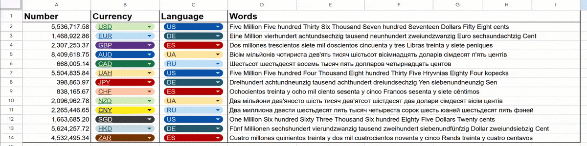

# 🚀 Google Sheets Amount to Words (No Script)

A powerful, native Google Sheets formula to convert numerical amounts into words (text). 
It supports a few **languages** and **currencies**, handles grammar (gender, plurals), and processes decimal parts (cents/kopecks/pence).

> **Key Feature:** It uses `LET` and `LAMBDA` functions. **No Apps Script required.** It works instantly and doesn't trigger security warnings.




## ✨ Features

* **⚡ Zero Scripts:** Pure formula logic. Blazing fast recalculations.
* **🌍 9 Languages:** English (US/UK), German (DE), Spanish (ES), Italian (IT), French (FR), Dutch (NL), Polish (PL), Ukrainian (UA), Russian (RU).
* **💰 17 Currencies:** USD, EUR, GBP, JPY, CHF, and 10 more.
* **🧠 Grammar Aware:** * Handles currency gender (e.g., "One Dollar" vs "Одна Гривня").
    * Handles pluralization rules for Slavic languages (1, 2-4, 5+).
    * Handles German compound numbers (e.g., "einundzwanzig").
* **🪙 Smart Decimals:** Converts cents, pence, kopecks, etc., respecting their gender and grammar.

## 📦 Installation & Usage

There are two ways to use this. The recommended way is creating a **Named Function**.

### Method 1: Named Function (Recommended)
This keeps your cells clean: `=AMOUNT_TO_WORDS(A2, "USD", "EN")`.

1.  Open your Google Sheet.
2.  Go to **Data** > **Named functions**.
3.  Click **Add new function**.
4.  **Function name:** `AMOUNT_TO_WORDS`
5.  **Argument placeholders:**
    * `val`
    * `curr_code`
    * `target_lang`
6.  **Formula definition:** Copy and paste the code from txt file into the definition box.

Now use it like this:
`=AMOUNT_TO_WORDS(1250.50, "USD", "EN")`
// Output: One Thousand Two hundred Fifty Dollars Fifty Cents

### Method 2: Direct Paste (No Named Function)

If you cannot or do not want to use Named Functions, you can paste the formula directly into a cell.

1.  Copy the code from the **Source Code** section above.
2.  Paste it into your target cell (e.g., `D2`).
3.  **Crucial Step:** You must manually replace the variable names at the very top of the formula with your actual cell references.

**Change this:**
```excel
=LET(
    val, val,
    curr_code, UPPER(curr_code),
    target_lang, UPPER(target_lang),
    ...
```
**To this (example):**
```excel
=LET(
    val, A2,                 <-- Reference to your Number
    curr_code, UPPER(B2),    <-- Reference to Currency Code
    target_lang, UPPER(C2),  <-- Reference to Language Code
    ...
```

## 📚 Supported Lists

| 🌍 Language (Code) | Native Name | &nbsp;&nbsp;&nbsp; | 💰 Currency (Code) | Currency Name |
| :--- | :--- | :--- | :--- | :--- |
| **EN** | English | | **USD** | US Dollar |
| **FR** | French | | **EUR** | Euro |
| **NL** | Dutch | | **GBP** | Pound Sterling |
| **DE** | German | | **JPY** | Japanese Yen |
| **ES** | Spanish | | **CHF** | Swiss Franc |
| **IT** | Italian | | **CNY** | Chinese Yuan |
| **UA** | Ukrainian | | **CAD** | Canadian Dollar |
| **PL** | Polish | | **AUD** | Australian Dollar |
| **RU** | Russian | | **PLN** | Polish Złoty |
| | | | **UAH** | Ukrainian Hryvnia |
| | | | **NZD** | New Zealand Dollar |
| | | | **SGD** | Singapore Dollar |
| | | | **HKD** | Hong Kong Dollar |
| | | | **ZAR** | South African Rand |
| | | | **SEK** | Swedish Krona |
| | | | **NOK** | Norwegian Krone |
| | | | **MXN** | Mexican Peso |

## ⚠️ Technical Notes & Limits

1.  **Max Value:** `999,999,999,999.99` (Up to 999 Billions). Numbers ≥ 1 Trillion are not supported in this version.
2.  **Rounding:** Automatically rounds numbers to **2 decimal places** (standard financial rounding).
3.  **Case Sensitivity:** Input codes are case-insensitive (`usd`, `USD`, `uSd` work equally well).
4.  **Compatibility:** Requires **Google Sheets** or **Excel 365/2021+**. Will not work in older Excel versions that lack `LET` and `LAMBDA` functions.
5.  **Grammar:** Outputs text in the **Nominative case** (Standard for invoices, contracts, and checks).
6.  **Negative Numbers:** Currently outputs an error string `"Error: Negative"`.

## 🛠️ Customizing & Contributing

Missing your language? You can add it by modifying two variables in the formula:

1.  **`RAW_NUM_STR`**: Add your language code and the corresponding string of numerals (ones, teens, tens, hundreds, magnitudes) separated by `~`.
2.  **`RAW_CURR_STR`**: Add your currency definitions in the format `CODE|Main1|Main2|Main5|Gender|Sub1|Sub2|Sub5|GenderSub`.

### 💡 Pro Tip: Use AI
Instead of formatting these strings manually, I highly recommend using **Gemini 3 Pro**. It handles the array structures and linguistic logic perfectly.

**Prompt example:** > *"Here is a Google Sheets LET formula. Please add Portuguese language support to the RAW_NUM_STR variable following the existing pattern."*

## 📄 License

This project is licensed under the MIT License - see the [LICENSE](LICENSE) file for details.
